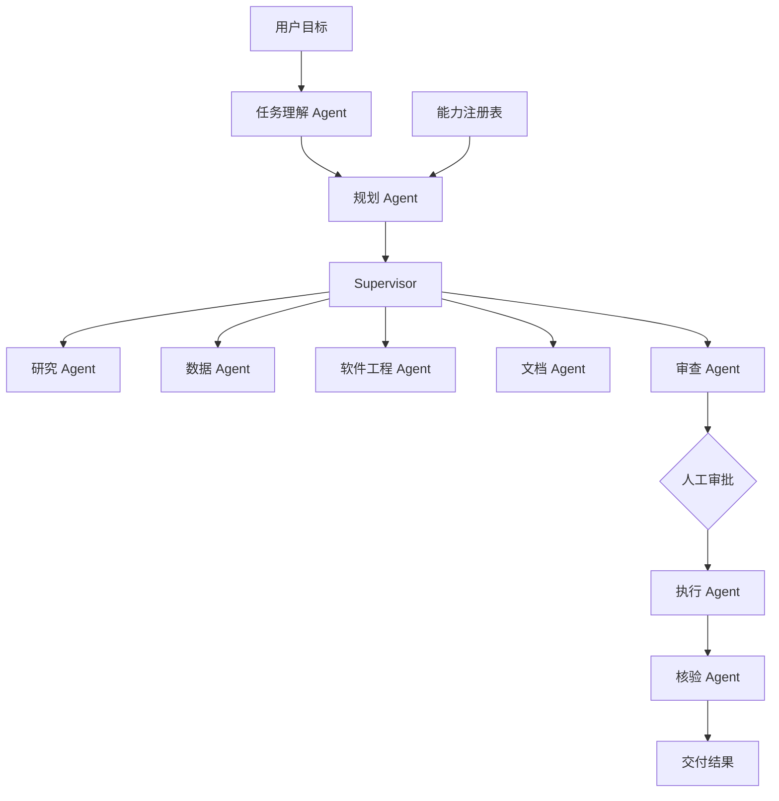

# Nexus 架构

Nexus 将通用性建立在任务契约、能力注册和受控调度上。简单任务可以只经过少量 Agent；复杂任务由 Planner 从能力注册表组装专业团队，再由 Supervisor 按依赖顺序调度。



## 运行原则

- Agent 使用结构化状态通信，不依赖隐式聊天历史传递关键数据。
- Planner 只从能力注册表选择已声明能力。
- Supervisor 负责交接、完成判断和停止条件，不直接处理专业任务。
- 高风险任务在执行前通过 LangGraph interrupt 暂停。
- 执行与核验分离；核验 Agent 必须重新检查执行记录。
- 所有 Agent 活动写入 `agent_trace`，API 和工作台展示相同审计链。
- 所有工具调用先经过角色权限检查，再写入 `tool_trace`。

## 工具边界

| 工具 | 授权 Agent | 访问级别 | 当前行为 |
|---|---|---|---|
| `extract_research_inputs` | 研究 Agent | 只读 | 提取用户提供的 URL 和研究约束 |
| `fetch_public_url` | 研究 Agent | 只读联网 | 抓取公开文本，阻止私网、本机和非 HTTP(S) 地址 |
| `analyze_csv` | 数据 Agent | 只读 | 解析 CSV、缺失值与数值统计 |
| `inspect_workspace` | 软件工程 Agent | 只读 | 忽略密钥与构建目录后盘点代码文件 |
| `prepare_external_action` | 执行 Agent | 模拟写入 | 使用审批信息生成执行回执 |

未经授权的 Agent 调用工具会抛出 `ToolPermissionError`，不会执行工具处理函数。

## 推理适配

Agent 通过 `ReasoningProvider` 协议请求结构化推理。`LocalStructuredReasoner` 保持结果确定、可测试且无需密钥；`OpenAIResponsesReasoner` 使用结构化 JSON Schema 输出，并由 `FallbackReasoner` 在网络或远程响应失败时回退到本地实现。两者不改变 Supervisor、审批或工具权限。

## 认证（双令牌）

浏览器和脚本都要先登录才能调用 `/api/*`（`/health` 保持公开给探针）。实现在 `apps/api/auth.py`（服务 + 路由）、`apps/api/auth_store.py`（SQLite 表）、`apps/api/security.py`（哈希与 JWT）。

**两个令牌分工不同，这不是装饰：**

| | 访问令牌 | 刷新令牌 |
|---|---|---|
| 有效期 | 30 分钟（`APP_ACCESS_TOKEN_TTL_SECONDS`） | 1 天；勾选"记住我"14 天 |
| 校验方式 | HS256 无状态校验，不查库 | 每次都查 `refresh_tokens` 表 |
| 能否吊销 | 不能，到期自然失效 | 能：登出、注销设备、改密码、泄露检测 |
| 轮换 | 每次刷新换新 | 每次刷新轮换，旧的立即作废 |

正因为访问令牌无法吊销，它才必须短命；正因为它短命，才需要一个可吊销、可轮换的刷新令牌来续期。`refresh_tokens` 只存令牌哈希（不存明文）和签发/到期、来源 UA 与 IP。轮换时沿用原租约长度，所以"延期"不会把有效期上限越刷越大。

**传输**：`POST /api/auth/login` 把两个令牌同时放进响应体（脚本/原生客户端走 `Authorization: Bearer`）和 httpOnly cookie（浏览器用）。浏览器端 JS 拿不到令牌，也不需要拿：`/api/auth/me` 返回"当前是谁、两个令牌何时到期"。EventSource（SSE）与导出链接会自动带 cookie，因此不需要把令牌塞进 URL。

**鉴权延期**：前端 `AuthProvider` 在访问令牌到期前 90 秒调 `/api/auth/refresh` 静默续期；任何请求撞上 401 也会先续期一次再原样重放（`app/auth/api.ts` 的 `apiFetch`）。两条路径共用同一个去重后的 Promise，并发请求只触发一次续期。标签页长时间挂起后回到前台会补一次。

**泄露检测**：轮换后的旧刷新令牌再次出现 → 判定泄露，吊销该账号全部会话；主动登出/注销设备留下的令牌被重放 → 只回 401，**不**连坐其他设备。两者的区别是 `replaced_by` 是否有值——这个区分是测试逼出来的，缺了它用户登出一台手机就会把整间办公室踢下线。

**登录保护**：密码 PBKDF2-HMAC-SHA256（24 万轮）加盐；连续失败 `APP_LOGIN_MAX_FAILURES` 次锁定 `APP_LOGIN_LOCKOUT_SECONDS` 秒；用户名不存在时也执行一次等价哈希，避免用响应时间枚举账号；`APP_JWT_SECRET` 低于 32 字符直接拒绝启动。

**上云清单**：`APP_JWT_SECRET`（≥32 字符，多实例必须一致）、`APP_COOKIE_SECURE=true`、跨站前端再设 `APP_COOKIE_SAMESITE=none`、显式设置 `APP_ADMIN_PASSWORD`、`APP_CORS_ORIGINS` 改成前端域名。SQLite 换托管数据库时 `users` / `refresh_tokens` / `app_secrets` 三张表要一起迁。

**已知边界**：`users.role` 已入库并随令牌下发，但尚未用于页面级授权；登录与改密事件没有单独的审计表（只在服务日志里）。这两处是明确的扩展点，不要在界面上宣称它们已生效。


## 运行控制：Agent / 知识库 / 对话

运行中心是**对话式**的：左侧是对话列表，右侧是「控制条 + 对话流 + 输入条」。用户消息靠右、Agent 回复靠左，审批作为一条内联卡片出现在回复里（它本来就阻塞运行，不该藏进详情页）。**步骤不进对话流**——计划、Agent 协作、工具调用与交付物都在独立的 `/workbench/runtime/<taskId>`「运行步骤」页，消息卡底部有入口。

三个控制项都真的改变运行时行为，不是界面装饰：

| 控制项 | 传参 | 真实效果 |
|---|---|---|
| 运行 Agent | `agent` | `"auto"` 由 Supervisor 按任务类型组队；给具体 id 时 `CapabilityRegistry.plan_for(..., only_agent=...)` 把计划收敛到该 Agent（会绕过任务类型过滤，否则"指定"在不适配的任务上会静默失效）。被禁用的 Agent 会退回自动组队，并在 `agent_trace` 里说明，不假装采纳 |
| 调用方式 | `use_knowledge_base` | `false` 时完全不读知识库文档，只注入工作区上下文 |
| 对话分组 | `conversation_id` | 同一次对话的多轮运行共享一个 id，前端按它聚合消息；发新消息时把最近几轮压成 `context` 带上，所以「连续追问」是真生效 |

**RAG 联动的口径**：检索是**关键词计分**（不是向量检索），命中结果会写进任务的 `knowledge` 字段回给界面：

```json
{"enabled": true, "bases": ["通用知识库"], "available": 3,
 "documents": [{"base": "通用知识库", "name": "选型规范.md"}]}
```

界面据此区分四种状态：未开启 / 没有启用的知识库 / 知识库暂无文档 / 已扫描 N 篇但无关键词命中 / 命中 N 篇。**只有最后一种才算用上了知识库**，其余都如实说出来。

> 踩过的坑：原来切词用 `[\w\u4e00-\u9fff]{2,}` 直接抓"连续中文串"，一整句中文会变成一个十多个字的"词"，在文档里永远匹配不到 —— 中文知识库等于检索不到。现在中文按**二元组**切（`retrieval_terms()`），ASCII 词原样，没有任何分词依赖。

高风险任务不受"运行 Agent"影响：审批门禁、执行与回查依然会追加进计划。

## Skill 中心与 MCP 中心

这两个页面从"示例数据 + localStorage"改成了真功能，各自的边界写清楚如下。

### Skill 中心：上传的文件真的会进提示词

`POST /api/skills` 收 multipart 上传，`apps/api/skills.py` 解析后落库，原始文件存 `data/skills/`：

| 格式 | 解析方式 |
|---|---|
| `.md` | 读 `---` frontmatter（只认 `key: value` 行，**不引 YAML 依赖**）拿 name/description/version/category/triggers；正文进 `content`。没有 frontmatter 就用文件名 + 正文首行当说明 |
| `.json` | 顶层对象的 name/description/version/triggers/tools；正文取 `content`/`instructions`/`prompt`/`body` |
| `.txt` | 首行当说明，全文当正文 |
| `.zip` | 在压缩包里找 `SKILL.md` 或 `skill.json` 再按上面解析 |

限制：单文件 ≤ 2 MB、必须 UTF-8、后缀白名单。导入后**默认停用**。

**启用的技能真的改变运行结果**：`WorkspaceService.managed_context` 会把启用技能的正文（各截 2000 字）作为 `[技能：名称]` 拼进任务上下文，并把技能名回写到 `TaskView.applied_skills`，对话卡片上能看到。正文为空的技能不会注入。

### MCP 中心：配置 CRUD + 真实握手

`apps/api/mcp.py` 保存 MCP 服务器配置，`POST /api/mcp/{id}/probe` 做的是**真实的 MCP 流式 HTTP 握手**：

1. `initialize`（带 `clientInfo` 与协议版本）→ 读 `mcp-session-id` 响应头；
2. `notifications/initialized`；
3. `tools/list` → 服务端自报的工具清单（`annotations.readOnlyHint` 映射成只读/写入）。

服务端自报的 `serverInfo.name/version`、工具清单与握手耗时都会存下来展示 —— 工具清单不是本地编的。响应同时兼容 JSON 与 SSE 两种返回体。鉴权令牌只用于请求，**接口永远不回显**（只回 `has_auth`）。

边界（界面上也这么写，不宣称已完成）：`stdio` 与 `sse` **不做探测** —— stdio 需要在服务器上拉起子进程，本机安全边界不允许由 HTTP 接口触发；探测到的工具**尚未接入运行时工具注册表**，也就是说 MCP 工具目前还不会被 Agent 真正调用。

默认允许探测内网/回环地址（本机 MCP 服务器基本都在 `127.0.0.1`），上云应设 `APP_MCP_ALLOW_PRIVATE_ENDPOINTS=false`，避免这个接口变成 SSRF 跳板。

## 工作台信息架构

侧边栏由 `apps/web/app/workbench/workbench-sidebar.tsx` 的 `navGroups` 数据驱动，加页面只需在这里加一行。菜单分两类：

- **hash section**：挂在 `/workbench` 上，用 URL hash 切换，共享同一份 `/api/workspace` 配置。目前是 `overview`、`agents`、`rag`、`context`、`models`、`governance`。
- **route**：各自独立的页面，用 Next.js 路由跳转。

| 分组 | 菜单 | 载体 | 数据来源 |
|---|---|---|---|
| 运行工作台 | 运行中心（对话） | route `/workbench/runtime` | `/api/tasks`（按 `conversation_id` 聚合成对话）+ `/api/system`（运行 Agent 候选）+ `/api/workspace`（知识库） |
| 运行工作台 | 运行步骤 | route `/workbench/runtime/<taskId>` | `/api/tasks`（单次运行的阶段、计划、协作、工具调用与交付物） |
| 运行工作台 | 运行审计 | route `/workbench/audit` | `/api/tasks`（工具调用与交接留痕） |
| 运行工作台 | 定时任务 | route `/workbench/schedules` | 示例数据 + localStorage |
| 能力构建 | 编排总览 | section `#overview` | `/api/workspace` + `/api/tasks` |
| 能力构建 | Agent 管理 | section `#agents` | `/api/workspace`、`/api/system`（能力注册表） |
| 能力构建 | 工作流编排 | route `/workbench/workflows` | 示例数据 + localStorage |
| 能力构建 | RAG 知识库 | section `#rag` | `/api/workspace` |
| 能力构建 | MCP 中心 | route `/workbench/mcp` | `/api/mcp`（配置 CRUD + 真实 MCP 握手探测） |
| 能力构建 | Skill 中心 | route `/workbench/skills` | `/api/skills`（上传解析入库，启用后进任务上下文） |
| 能力构建 | 附件资产 | route `/workbench/assets` | 示例数据 + localStorage |
| 能力构建 | 上下文管理 | section `#context` | `/api/workspace` |
| 能力构建 | 模型与工具 | section `#models` | `/api/workspace` |
| 治理与观测 | 治理策略 | section `#governance` | `/api/workspace` |
| 治理与观测 | 可观测性 | route `/workbench/observability` | 示例数据 |
| 治理与观测 | Token 用量 | route `/workbench/usage` | 示例数据 + localStorage（预算设置） |
| 治理与观测 | 运行环境 | route `/workbench/system` | `/api/system` |
| 工作区设置 | 租户与成员 | route `/workbench/tenants` | 示例数据 + localStorage |
| 工作区设置 | 账号设置 | route `/workbench/settings` | `/api/auth/*`（修改密码、活跃会话）+ 示例数据（资料、密钥） |

**示例数据页面**：表格中标注 `示例数据` 的页面尚未接入后端表，数据以 `apps/web/app/workbench/ui/data.ts` 的种子为基础，改动写入浏览器 `localStorage`（命名空间 `nexus.workbench.v1.`）。这些页面统一渲染「示例数据」提示条，不会被误认为真实状态。要接入后端时，把 `useCollection` / `useRecord`（`apps/web/app/workbench/ui/store.ts`）的实现换成 `fetch` 即可，组件层不用改。

**上下文条目的生效范围**：`WorkspaceService.task_context()` 只读取 `contexts[]` 里的三个键 —— `enabled`、`scope`、`content`，并把所有 `enabled == true && scope == "workspace"` 的 `content` **按数组顺序**拼进提示词。因此：

- 「顺序」是真的：调整列表顺序会改变提示词的拼接顺序，工作台的上移/下移因此是有效操作。
- `budget`（参考预算）、`kind`（类型）、`tags`（标签）、`description`（说明）**都不参与运行时注入**，只是工作台内的组织与规划信息 —— 界面上也按这个口径标注，不要把它们描述成运行时限制。
- `scope` 为 `task` / `agent` 的条目不会自动注入，目前只作为配置意图保存。

**共享 UI 组件**：`apps/web/app/workbench/ui/` 下的 `shell.tsx`（页面外壳 + 面包屑）、`primitives.tsx`（卡片 / 表格工具条 / 表单 / 弹窗 / 抽屉 / 状态提示）、`table.tsx`（排序 + 分页表格）、`charts.tsx`（无依赖 SVG 图表）。样式统一追加在 `workspace-layout.css`，它必须由页面组件最后导入，否则会被页面级 `workbench.css` 反向覆盖。

**样式层叠契约**：`globals.css` → `tools.css` → `workbench.css` → `sidebar.css` → `workspace-layout.css`（最终权威）。同一属性只允许在最后一个文件里声明一次：后加载文件里的**无条件**规则会静默压掉先加载文件的 `@media`，这一点踩过坑（窄屏侧边栏重置曾因此整段失效）。外壳尺寸的调整集中在 `workspace-layout.css` 末尾的 `Density layer`，它只改尺寸、不改布局结构。

## 当前边界

当前默认使用本地规则运行时。数据 Agent 可以分析用户粘贴的 CSV，代码 Agent 可以只读盘点当前工作区，研究 Agent 可以整理或受控抓取公开来源；系统不会伪造代码修改结果。后续可通过能力注册表绑定 MCP 和隔离代码沙箱。

任务与事件写入 SQLite，服务重启后可恢复待审批任务。LangGraph 检查点在单次进程内保存；重启后系统会以持久化任务输入重放到相同审批边界，再接受审批决定。大文件和多实例部署仍需要对象存储及共享检查点数据库。
